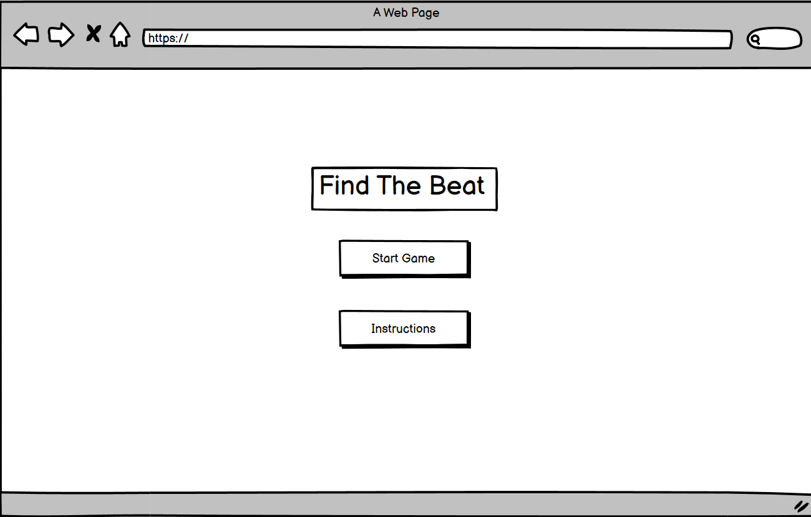
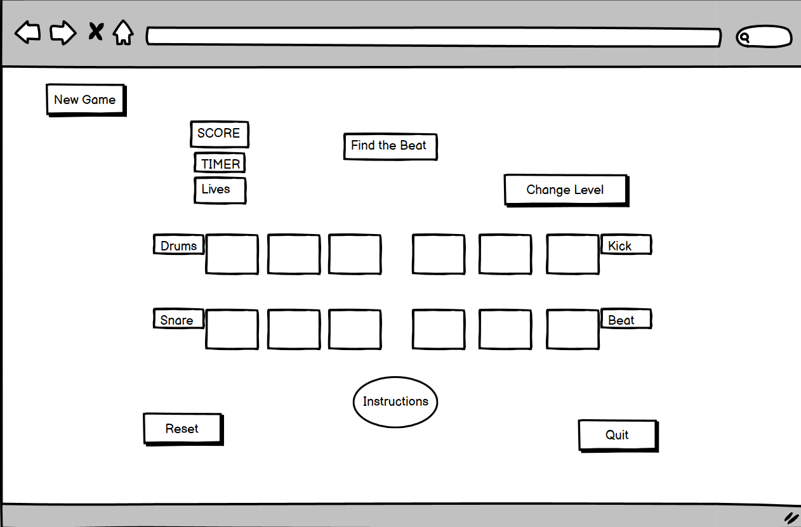
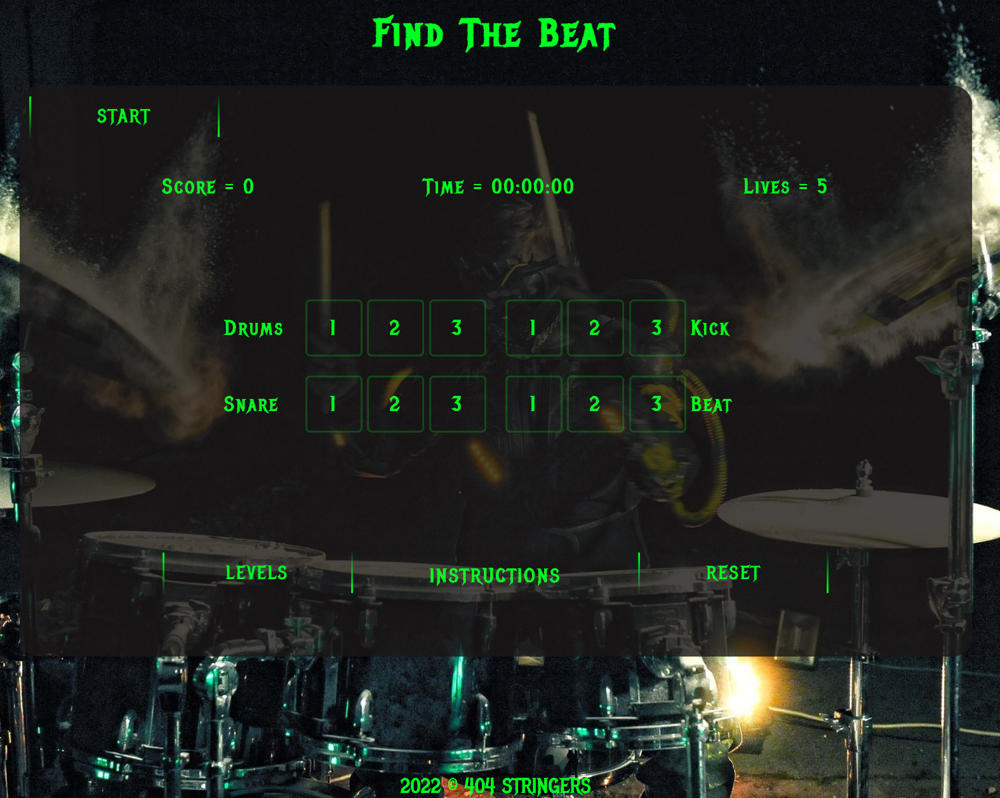
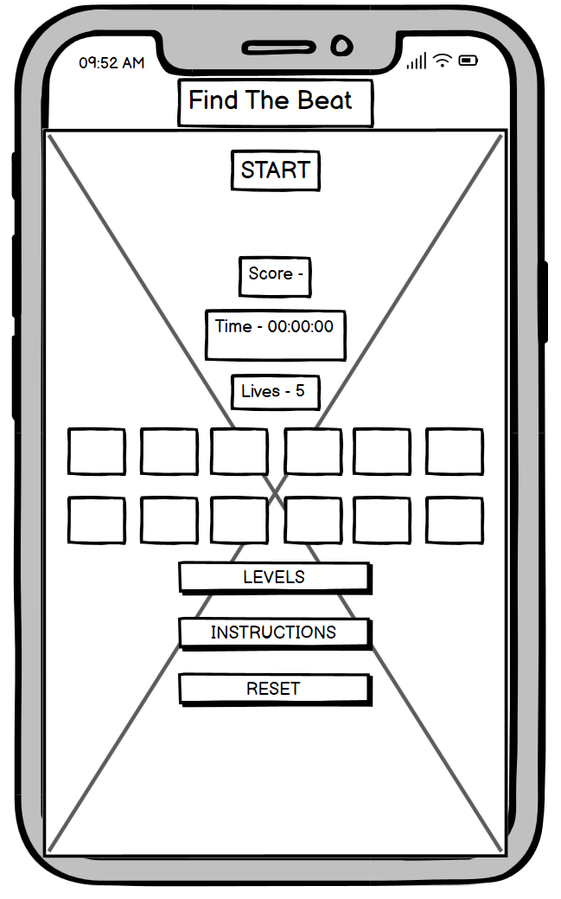
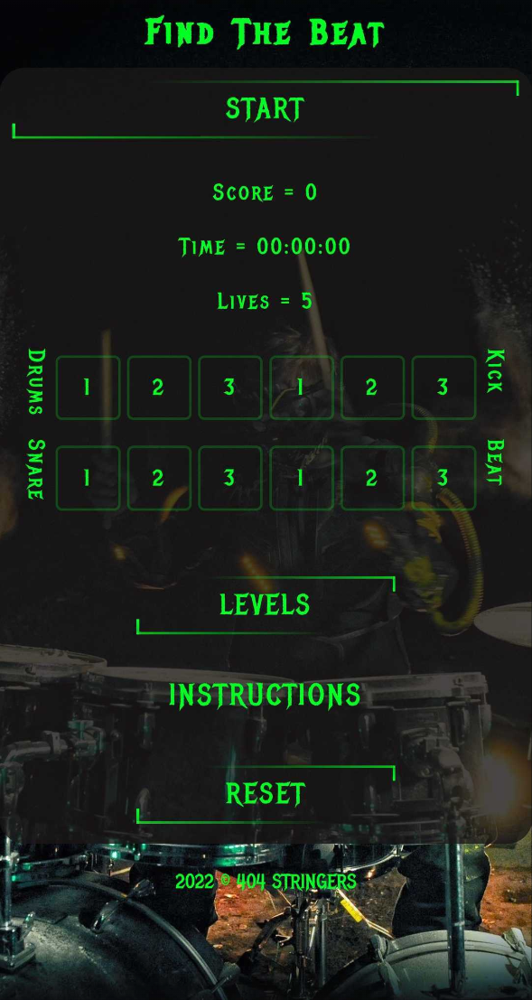
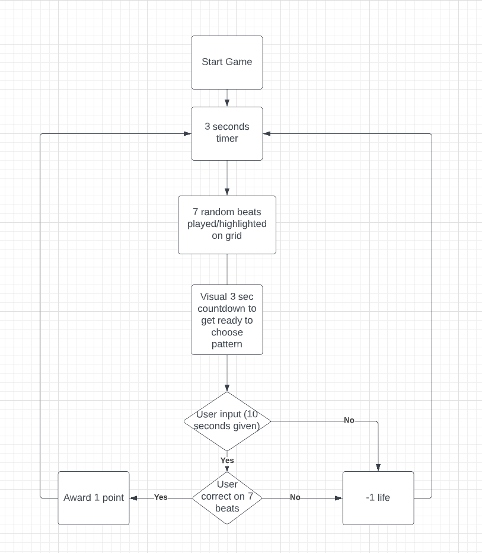

# _PROJECT NAME: Find The Beat_ : _Hackathon Nov 2022_

### Deployed link

[Click here to play!](https://newviewnewbeginning.github.io/FindTheBeat-Continue/)

## How to play

- There will be a random 7-sequence beat scattered around the board's instrumments.
- You will then be given 3 seconds to memorise the beat/locations of the sounds.
- Select all the correct instrumments in the correct order to earn 1 point.
- If you fail to select atleast 1 sound you will lose 1 Life.
- If any beat is missed you will lose 1 Life.
- If the sequence is not correct you will lose 1 Life.
- You will then be given a new sequance in the next round.

## Project Overview

Find the beat is a music-based memory pattern game.  
The application was made by Monika, Michal, Bogdan, and Sador.

- When start the game is pressed player is introduced to 3 seconds loading stage until the game board is shown.
  After that what is supposed to happen is, a 7-beat pattern scattered around the board of instruments.
  If the user fails to register at least 1 beat the program should remove 1 life
  When the player guessed all beats they will then move on to the next sequence.
- There is a levels button option - this should increase the number of beats to a higher number to memorize.
- The reset button will reset the sequence mid-game if user chooses so.

## Wireframes

Wireframe has been designed based on on high level functionality of the music game, some of this might not be displayed in the final product of the game memory board.

Desktop

- Final Result

Mobile

- Final result

## Flowchart of game play

## Existing Features

- **The landing page image**

## Credits

- Monika
- Michal
- Bogdan
- Sador
